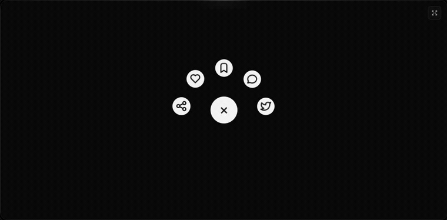
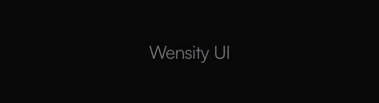
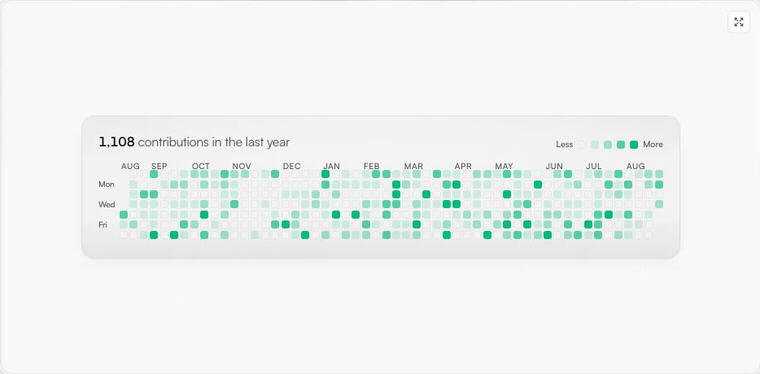
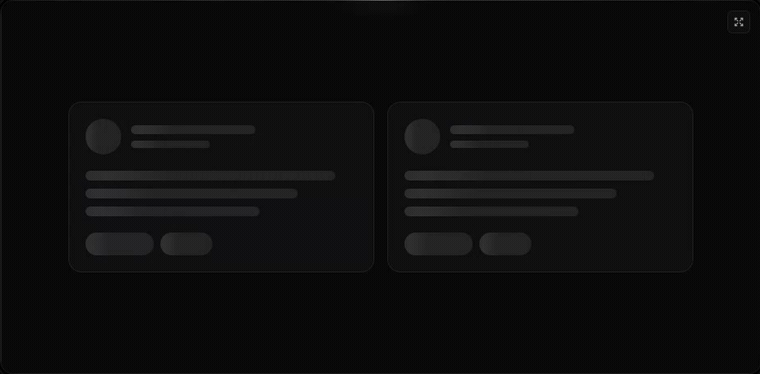

# Wensity shadcn Registry

The public shadcn/ui registry for [Wensity](https://ui.wensity.com). Install React
components, text animations, UI primitives, fonts, and design tokens straight into your project
with the shadcn CLI. The code lands in your repo as source you own, with no
runtime dependency on Wensity and no theme provider to wire up.

[Browse the components](https://ui.wensity.com/components) ·
[Docs](https://ui.wensity.com/docs) ·
[Create a preset](https://ui.wensity.com/create-preset) ·
[wensity.com](https://wensity.com)


<table>
  <tr>
    <td width="50%" align="center">
      
      <br><sub><code>gooey-navigation-menu</code></sub>
    </td>
    <td width="50%" align="center">
      
      <br><sub><code>text-shimmer</code></sub>
    </td>
  </tr>
  <tr>
    <td width="50%" align="center">
      
      <br><sub><code>github-activity-grid</code></sub>
    </td>
    <td width="50%" align="center">
      
      <br><sub><code>shimmering-skeleton-wrapper</code></sub>
    </td>
  </tr>
</table>

## Install

Every item in this registry is free and MIT licensed. Install one with the
shadcn CLI:

```bash
npx shadcn@latest add @wensity/liquid-multimodal-input
```

The `@wensity` namespace is registered in shadcn's public registry index, so it
resolves without any `components.json` configuration on your side.

You can also point at this repository directly:

```bash
npx shadcn@latest add https://raw.githubusercontent.com/wensity/registry/main/button.json
```

### Start with the base tokens

`wensity-base` installs the CSS custom property contract that every Wensity
component reads from. Add it once before or after your first component:

```bash
npx shadcn@latest add @wensity/wensity-base
```

Components still render without it, falling back to your existing shadcn
variables, but the base contract is what makes radius, control colors, and
motion consistent across the set.

## Requirements

- React 18 or later
- Tailwind CSS v4
- A project already initialised with `npx shadcn@latest init`

Individual items declare their own npm dependencies (`framer-motion`,
`@tabler/icons-react`, `@base-ui/react`, and similar). The shadcn CLI installs
those for you at add time.

## What is in here

91 registry items across six groups.

### Agentic AI Interfaces

Chat, voice, and model-selection surfaces for AI products.

| Item | Name | Description | Install |
| --- | --- | --- | --- |
| [`liquid-multimodal-input`](https://ui.wensity.com/components/liquid-multimodal-input) | Liquid Multimodal Input | Expanding prompt area with a glowing drop-zone. | `npx shadcn@latest add @wensity/liquid-multimodal-input` |
| [`generative-skeleton-mesh`](https://ui.wensity.com/components/generative-skeleton-mesh) | Generative Skeleton Mesh | An organic loading state, not a spinner. | `npx shadcn@latest add @wensity/generative-skeleton-mesh` |
| [`voice-aurora-wave`](https://ui.wensity.com/components/voice-aurora-wave) | Voice Aurora Wave | A breathing voice orb. Never jittery, always organic. | `npx shadcn@latest add @wensity/voice-aurora-wave` |
| [`model-context-switcher`](https://ui.wensity.com/components/model-context-switcher) | Model Context Switcher | A Radix dropdown that scales out from the trigger and glides between options. | `npx shadcn@latest add @wensity/model-context-switcher` |

### Text Animations

Headline and word-level motion, from shimmer and glitch to scribble and morph.

| Item | Name | Description | Install |
| --- | --- | --- | --- |
| [`text-shimmer`](https://ui.wensity.com/components/text-shimmer) | Text Shimmer | A CSS shimmer sweep for headlines, one single element and entirely GPU-friendly. | `npx shadcn@latest add @wensity/text-shimmer` |
| [`text-flip`](https://ui.wensity.com/components/text-flip) | Text Flip | A 3D character flip on hover, staggered and springy across every single letter. | `npx shadcn@latest add @wensity/text-flip` |
| [`text-morphing`](https://ui.wensity.com/components/text-morphing) | Text Morphing | Blur-morphing headlines that cycle phrases with a gooey, seamless crossfade. | `npx shadcn@latest add @wensity/text-morphing` |
| [`text-char-slide`](https://ui.wensity.com/components/text-char-slide) | Text Char Slide | A per-character slide-left cascade with a cleanly staggered entrance timing. | `npx shadcn@latest add @wensity/text-char-slide` |
| [`text-motion`](https://ui.wensity.com/components/text-motion) | Text Motion | Headline entrances driven entirely by your own custom Framer Motion variants. | `npx shadcn@latest add @wensity/text-motion` |
| [`text-cycle`](https://ui.wensity.com/components/text-cycle) | Text Cycle | Cycles through your headline words with a soft per-character blur stagger. | `npx shadcn@latest add @wensity/text-cycle` |
| [`text-word-flip`](https://ui.wensity.com/components/text-word-flip) | Text Word Flip | Spring-loaded word flips paired with a soft letter-by-letter blur stagger. | `npx shadcn@latest add @wensity/text-word-flip` |
| [`text-blur-reveal`](https://ui.wensity.com/components/text-blur-reveal) | Text Blur Reveal | A blur-in stagger by word or by letter, triggered the moment you scroll. | `npx shadcn@latest add @wensity/text-blur-reveal` |
| [`canvas-text`](https://ui.wensity.com/components/canvas-text) | Canvas Text | Loading-ring canvas particles that slowly resolve into solid letterforms. | `npx shadcn@latest add @wensity/canvas-text` |
| [`line-fill-text`](https://ui.wensity.com/components/line-fill-text) | Line Fill Text | Alpha-cascade ribbons clipped neatly inside the letterforms themselves. | `npx shadcn@latest add @wensity/line-fill-text` |
| [`text-glitch`](https://ui.wensity.com/components/text-glitch) | Text Glitch | A chromatic clip-path glitch for headlines, CSS-only and entirely GPU-friendly. | `npx shadcn@latest add @wensity/text-glitch` |
| [`text-path`](https://ui.wensity.com/components/text-path) | Text Path | SVG text riding a curved wave, arc, or circle path on a seamless, light loop. | `npx shadcn@latest add @wensity/text-path` |
| [`text-highlight`](https://ui.wensity.com/components/text-highlight) | Text Highlight | A hand-placed highlighter band that sweeps in behind your text and tracks wrapping. | `npx shadcn@latest add @wensity/text-highlight` |
| [`text-scribble`](https://ui.wensity.com/components/text-scribble) | Text Scribble | Hand-drawn scribble, underline, and strike marks that draw themselves onto text. | `npx shadcn@latest add @wensity/text-scribble` |
| [`text-chroma-reveal`](https://ui.wensity.com/components/text-chroma-reveal) | Text Chroma Reveal | A chromatic ribbon sweep that paints each of your headlines cleanly into view. | `npx shadcn@latest add @wensity/text-chroma-reveal` |
| [`text-spectrum`](https://ui.wensity.com/components/text-spectrum) | Text Spectrum | An animated multi-stop color wash that drifts endlessly through headlines. | `npx shadcn@latest add @wensity/text-spectrum` |
| [`text-ripple`](https://ui.wensity.com/components/text-ripple) | Text Ripple | A 3D character ripple with a traveling color crest, CSS-only and GPU-light. | `npx shadcn@latest add @wensity/text-ripple` |

### Cinematic Interactions

Scroll and motion pieces for landing pages and hero sections.

| Item | Name | Description | Install |
| --- | --- | --- | --- |
| [`infinite-marquee`](https://ui.wensity.com/components/infinite-marquee) | Infinite Marquee | A seamless, GPU-only logo strip that never stutters or snaps at the loop point. | `npx shadcn@latest add @wensity/infinite-marquee` |
| [`morphing-shape-background`](https://ui.wensity.com/components/morphing-shape-background) | Morphing Shape Background | Lava-lamp blobs that drift behind your hero at 120fps with no SVG morphing. | `npx shadcn@latest add @wensity/morphing-shape-background` |
| [`scrubbable-video-reveal`](https://ui.wensity.com/components/scrubbable-video-reveal) | Scrubbable Video Reveal | An Apple-style image sequence scrubbed frame by frame on canvas, following your hand as you scroll in either direction. | `npx shadcn@latest add @wensity/scrubbable-video-reveal` |
| [`animated-tabs`](https://ui.wensity.com/components/animated-tabs) | Animated Tabs | A physical stack of photo cards shuffled to the front by clipped tabs, with a tight image inset and copy in the footer. | `npx shadcn@latest add @wensity/animated-tabs` |

### Elite Micro-Interactions

Small, high-polish interaction details.

| Item | Name | Description | Install |
| --- | --- | --- | --- |
| [`gooey-navigation-menu`](https://ui.wensity.com/components/gooey-navigation-menu) | Gooey Navigation Menu | A liquid FAB whose child actions stretch out of the trigger like molten metal. | `npx shadcn@latest add @wensity/gooey-navigation-menu` |
| [`multi-select-token-pills`](https://ui.wensity.com/components/multi-select-token-pills) | Multi-Select Token Pills | A tag input where pills pop in as you add them and slide out on remove, closing the gap without snapping the layout. | `npx shadcn@latest add @wensity/multi-select-token-pills` |
| [`shimmering-skeleton-wrapper`](https://ui.wensity.com/components/shimmering-skeleton-wrapper) | Shimmering Skeleton Wrapper | One angled GPU sweep that travels across any placeholder geometry you wrap, never a separate shimmer stuttering per row. | `npx shadcn@latest add @wensity/shimmering-skeleton-wrapper` |
| [`cool-button`](https://ui.wensity.com/components/cool-button) | Cool Button | A dual-layer orbit glow that soft-spins around the edge of any button or link you wrap it around, at zero layout cost. | `npx shadcn@latest add @wensity/cool-button` |
| [`file-uploader`](https://ui.wensity.com/components/file-uploader) | File Uploader | A bold red dropzone for any file, with gallery tiles and progress after upload. | `npx shadcn@latest add @wensity/file-uploader` |
| [`before-after-card`](https://ui.wensity.com/components/before-after-card) | Before After Card | Drag the handle to wipe between before and after images with absolutely zero lag. | `npx shadcn@latest add @wensity/before-after-card` |

### Heavy SaaS Blocks

Larger composed blocks for dashboards and product pages.

| Item | Name | Description | Install |
| --- | --- | --- | --- |
| [`github-activity-grid`](https://ui.wensity.com/components/github-activity-grid) | GitHub-Style Activity Grid | 365 squares, one shared tooltip, and a cascading reveal that ripples backward from today. | `npx shadcn@latest add @wensity/github-activity-grid` |

### UI Primitives

The standard set, built on Base UI with Wensity's token contract. Accessible,
unstyled-first, and themeable through the primitive CSS block.

`button`, `button-group`, `input`, `text-area`, `select`, `form-field`, `badge`, `checkbox`, `switch`, `radio-group`, `toggle`, `label`, `input-otp`, `combobox`, `avatar`, `table`, `progress`, `alert`, `skeleton`, `spinner`, `toast`, `dialog`, `sheet`, `drawer`, `popover`, `tooltip`, `tabs`, `breadcrumb`, `pagination`, `card`, `separator`, `scroll-area`, `resizable`, `hover-card`, `accordion`, `aspect-ratio`, `attachment`, `calendar`, `carousel`, `chart`, `collapsible`, `slider`, `command`, `context-menu`, `data-table`, `date-picker`, `direction`, `dropdown-menu`, `empty-state`, `field`, `kbd`, `marker`, `native-select`, `navigation-menu`, `sidebar`, `typography`

Install any of them the same way:

```bash
npx shadcn@latest add @wensity/button @wensity/dialog @wensity/data-table
```

### Fonts and base tokens

| Item | What it does | Install |
| --- | --- | --- |
| `font-inter` | Registers Inter with the Wensity font token contract | `npx shadcn@latest add @wensity/font-inter` |
| `font-geist` | Registers Geist with the Wensity font token contract | `npx shadcn@latest add @wensity/font-geist` |
| `wensity-base` | The CSS custom property contract for color, radius, and motion | `npx shadcn@latest add @wensity/wensity-base` |

## Theming with presets

Wensity components read from a single `--primitive-*` CSS block, so you can
restyle the whole set without touching component source. Build a palette,
radius, and font combination in the
[preset studio](https://ui.wensity.com/create-preset), copy the resulting
`wsty1` code, and apply it with the Wensity CLI:

```bash
npx wensity@latest apply --preset <wsty1-code>
```

That rewrites the CSS block in place and leaves your component files alone. See
the [preset guide](https://ui.wensity.com/docs/create-preset) for the full
format.

## Using the Wensity CLI instead

The shadcn CLI covers everything in this repository. The
[Wensity CLI](https://github.com/wensity/cli) additionally handles presets,
project scaffolding, Tabler and Lucide icon swapping, and authenticated access
to Wensity Pro components.

```bash
npx wensity@latest init
npx wensity@latest add liquid-multimodal-input
```

## How this repository is generated

These files are build artifacts, not hand-written source. They are generated
from Wensity's public shadcn endpoints:

- Registry index: <https://ui.wensity.com/r/registry.json>
- Item payloads: `https://ui.wensity.com/r/<item>.json`

The Wensity product repository is private and is not mirrored here. This
repository contains only the free registry payloads. Wensity Pro components are
delivered through the authenticated CLI and are not published here.

Because the JSON is generated, please do not send pull requests that edit it
directly. Open an issue instead and the change will be made upstream.

A release is published from Wensity's private source repository with a single
command, which updates this repository and the legacy compatibility mirror at
`ksparth12/wensity-shadcn-registry` in the same run. The two are always
generated together, so they cannot drift.

## License

MIT. See [LICENSE](./LICENSE).

Copyright (c) 2026 Wensity Private Limited.
